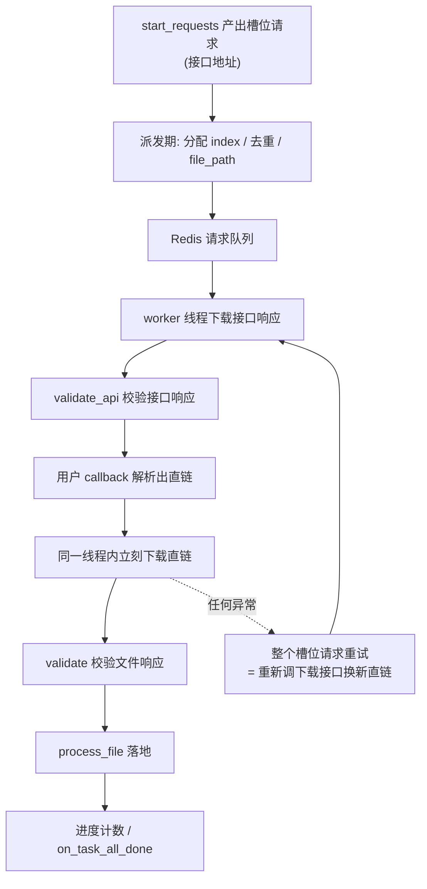

# FileSpider

FileSpider 是一款分布式文件下载爬虫，专用于批量下载文件/图片的场景。

核心特征：
- **一对多**: 一个任务包含多个待下载文件，由用户在 `start_requests` 中 yield 多个请求，每个请求占一个“文件槽位”
- **双模式**: 既支持直链直接下载，也支持先请求下载接口换取加签直链再下载（见[下载模式](#3-下载模式)）
- **请求灵活**: 可自由设置 headers/method/data/proxies/render/中间件/校验函数等
- **进度追踪**: 框架自动追踪每个任务的下载进度（成功数/失败数/跳过数/去重数/总数）
- **结果有序**: 下载结果列表与 `start_requests` 中 yield 的槽位顺序严格对应
- **全程流式**: `file_chunks` 提供字节流迭代器，下载、压缩、上传可全程不落盘、不进内存
- **灵活存储**: 默认保存到本地磁盘，可重写为上传云存储（COS/OSS/S3 等）
- **文件去重**: 任务内自动去重；可选跨任务去重（Redis / MySQL / 自定义）
- **HTTP 校验**: 默认对 4xx/5xx 响应触发重试，可全局重写 `validate`，也可按请求单独指定
- **用户控制**: 任务成功/失败由用户在回调中显式决定

FileSpider 继承自 TaskSpider，复用了全部任务管理能力（MySQL 任务表、Redis 队列、断点续爬、丢失任务回收、分布式支持等）。

## 1. 任务表

### MySQL 任务表（建议结构）

```sql
CREATE TABLE `file_task` (
  `id` int(11) NOT NULL AUTO_INCREMENT,
  `file_urls` text COMMENT '待下载文件URL列表，JSON数组格式',
  `state` int(11) DEFAULT 0 COMMENT '任务状态: 0待做 2下载中 1完成 -1失败',
  PRIMARY KEY (`id`),
  KEY `idx_state` (`state`)
) ENGINE=InnoDB DEFAULT CHARSET=utf8mb4;
```

字段说明：
- `id`: 任务主键，必须有
- `file_urls`: 存放待下载文件 URL 的 JSON 数组，字段名可自定义
- `state`: 任务状态字段，字段名可通过 `task_state` 参数配置。0=待做，2=已下发（框架自动设置），1=完成，-1=失败（由用户代码设置）

索引建议：
- `state` 是调度核心字段，框架会按 `check_task_interval`（默认 5 秒）轮询 `where state=0/2`；任务表行数较多时，建议加单列索引 `KEY idx_state (state)`，避免反复全表扫描。
- 如果使用了 `task_condition` 按业务字段筛选任务（例如 `biz_type='image' and priority>=10`），建议改建复合索引 `KEY idx_state_biz (state, biz_type, priority)`，将 `state` 放在最左。
- 如果配置了非主键的 `task_order_by`，可把排序字段放到复合索引尾部以避免 filesort。

## 2. 用户需实现的方法

### 必须实现

| 方法 | 说明 |
|------|------|
| `start_requests(task)` | yield 该任务的所有文件请求，每个 `Request` 占一个文件槽位 |
| `on_task_all_done(task, result, stats)` | 任务所有文件处理完毕的回调，在此 yield Item 或 update_task_batch 更新状态 |

### 框架提供的辅助方法

| 方法 | 说明 |
|------|------|
| `download_request(task, url, **kwargs)` | 构造下载请求，自动注入框架元数据。`**kwargs` 透传到 `Request`，可设置 headers/method/data/proxies/render/timeout/validate/download_midware 等。文件保存路径统一由 `file_path` 决定 |
| `file_chunks(response, chunk_size=1MB)` | 返回响应内容的字节流迭代器，供 `process_file` 流式消费；整个流为零字节时抛异常触发重试 |

### 可选重写

| 方法 | 说明 | 默认行为 |
|------|------|----------|
| `file_path(request)` | 返回文件最终存储位置/标识；该返回值会作为 `result` 列表元素、`file_dedup` 缓存值、`request.file_path` | `{save_dir}/{task.id}/{index}_{md5(filename)}{ext}` |
| `process_file(request, response)` | 将下载内容落地到 `request.file_path`；返回 `True`/`None` 视为成功，返回 `False` 显式失败（不重试），抛异常触发重试 | 消费 `file_chunks` 流式写入本地磁盘，返回 `None` |
| `file_chunks(response, chunk_size)` | 字节流迭代器；重写可插入自定义校验或调整分块大小 | 按 1MB 分块迭代，零字节抛异常 |
| `validate(request, response)` | 校验响应（所有请求的兜底校验，可被 `Request(validate=...)` 覆盖） | 404 判失败不重试，其余 4xx/5xx 抛异常触发重试，3xx 自动跟随 |
| `on_file_downloaded(request)` | 单个文件下载成功回调；用 `request.file_path` 取存储位置 | 无 |
| `on_file_failed(request, error)` | 单个文件失败回调 | 无 |
| `dedup_key(request)` | 返回该文件的去重键，详见[文件去重](#6-文件去重) | 直链模式返回 `request.url`；接口模式无默认值 |

### request 上的属性（文件维度上下文）

`file_path / validate / process_file / on_file_*` 这些"文件维度"钩子都接收同一个 `request` 对象，用户可访问：

| 属性 | 含义 |
|------|------|
| `request.url` | 请求 URL。直链模式下是文件直链；接口模式下槽位请求是接口地址，下载请求是直链 |
| `request.task` | PerfectDict 任务对象（可 `request.task.id` / `request.task.其他字段`） |
| `request.task_id` | `task.id` 的便捷别名 |
| `request.file_path` | `file_path()` 钩子返回值 |
| `request.index` | 该文件在任务槽位序列中的索引（按 `start_requests` yield 顺序） |
| 任意自定义属性 | 用户在请求上挂的字段（如 `request.biz_type`），接口模式下槽位请求的自定义字段不会自动带到下载请求上，需要时在回调里再挂一次 |

> 例外：`file_path(request)` 钩子调用时 `request.file_path` 还不存在（它就是该钩子的返回值），其它属性都在。

### 方法分层

```
start_requests (用户实现)
  ├── yield self.download_request(task, url, **kwargs)   # 直链槽位
  └── yield feapder.Request(接口地址, callback=自己的方法)  # 接口槽位

distribute_task (框架层，按 yield 顺序分配 index、去重、缓存命中、写 Redis 进度)
  ├── file_path(request) (用户层，按需重写) → 决定权威存储位置
  └── 下发槽位请求

[仅接口模式] 用户 callback (用户实现)
  └── yield self.download_request(task, 直链)  # 恰好一个，框架立刻同线程执行下载

save_file (框架层，不应重写)
  ├── process_file(request, response) (用户层，按需重写)
  │     ├── file_chunks(response) (框架层，可重写) → 字节流迭代器
  │     ├── return True/None: 成功 → 写 result/dedup → on_file_downloaded(request)
  │     ├── return False: 显式失败 → 计入 fail → on_file_failed(request, error)
  │     └── raise: 触发重试
  ├── 关闭响应 (自动，process_file 结束即释放连接)
  ├── Redis 进度追踪 (自动，幂等计数)
  └── 检查是否所有文件完成
        └── on_task_all_done(task, result, stats) (用户实现)
              ├── yield Item → 写入结果表
              └── yield update_task_batch → 更新任务状态
```

### 重要约束

- **所有文件槽位必须从 `start_requests(task)` 直接 yield**：进度追踪需要在派发前知道文件总数，
  因此不支持在中间回调（如先抓列表页再决定下载哪些文件）中新增槽位。如有此类需求，
  需先用普通 Spider 解析出文件清单落入任务表，再交给 FileSpider 下载。
- **`start_requests` 中的每个 `Request` 都是一个文件槽位**：包括直接 `yield feapder.Request(...)`。
  这里不能 yield 与文件无关的普通请求，否则会凭空多出一个永远不会完成的文件槽位。
- 在 `start_requests` 中允许同时 yield `Item` / `update_task_batch` 等非请求产物，它们不占槽位，框架会按原有规则分发。
- **单任务文件数建议在 1 万以内**：派发期需要把任务的所有槽位请求一次性物化、做任务内去重并原子写入 Redis 进度状态。文件数量极大时（如数万、数十万）会出现明显的内存峰值与派发延迟，建议把超大批量拆成多个任务（例如按业务分片），每个任务承载若干百到若干千个文件。

### `process_file` 约束

`process_file(request, response)` 是"落地动作"，**不返回路径**——路径以 `file_path()` 的返回值为准（即 `request.file_path`）。

**响应由框架关闭**：`process_file` 返回或抛异常后，框架都会立刻 `response.close()` 释放连接，用户不需要自己写 `try/finally`。

**返回值语义**:

| 返回值 | 含义 |
|--------|------|
| `True` 或 `None` | 处理成功；框架写入 `result_key`、`file_dedup` 缓存（值均为 `request.file_path`），调用 `on_file_downloaded(request)` |
| `False` | 显式失败：**不再重试**，直接计入 `stats.fail`，调用 `on_file_failed(request, error)` |
| 抛异常 | 触发框架重试机制 |

**幂等性要求**: 在下载失败重试时可能被多次调用（同一 URL、同一 `request.file_path`），实现需保证幂等：
- 默认实现使用 `"wb"` 模式覆盖写入，天然幂等
- 重写时避免使用追加模式（`"ab"`）
- 云存储场景建议使用 `put_object` 等覆盖语义的 API

**何时该用 `False` vs 抛异常**:
- 用 `False`：内容校验失败、业务规则不允许保存、下载到的文件明显是错的 —— 这些重试也无意义。
- 抛异常：临时性错误（网络写盘失败、OSS 偶发 5xx 等）—— 框架会按重试策略再尝试。

### `on_task_all_done` 参数说明

```python
def on_task_all_done(self, task, result, stats):
    """
    task: PerfectDict - 任务对象，包含 task_keys 指定的字段，可通过 task.id 获取任务 ID
    result: List[str|None]
    - 与 start_requests 中 yield 的下载请求顺序严格对应
    - 成功: file_path() 的返回值
    - 失败/跳过: None
    - 任务内重复URL: 继承首次出现的结果
    例: ["downloads/1/0_a.jpg", "downloads/1/1_b.jpg", None, "downloads/1/3_d.jpg"]
    stats: FileTaskStats - namedtuple
    - stats.success: 成功数（含跨任务去重缓存命中）
    - stats.fail:    失败数（重试耗尽 + process_file 显式返回 False）
    - stats.skipped: 跳过数（无效URL、file_path异常等）
    - stats.dup:     任务内重复URL数
    - stats.total:   总数（success + fail + skipped + dup = total）
    - 也支持元组解包: success, fail, skipped, dup, total = stats
    """
```

如需 type hint：

```python
from feapder import FileTaskStats

def on_task_all_done(self, task, result: list, stats: FileTaskStats): ...
```

#### 重复 URL 与计数器关系

`result` 列表的长度严格等于 `start_requests` yield 的下载请求数（即 `stats.total`），**重复 URL 不会被压缩，仍然占一个位置**，其值继承首次出现位置的最终结果。计数器满足不变式：

```
total = success + fail + skipped + dup
```

| 计数器 | 含义 | 是否包含重复位置 |
|--------|------|------|
| `stats.success` | 下载成功 + 跨任务去重缓存命中 | 否 |
| `stats.fail` | 下载失败（重试耗尽 或 `process_file` 显式返回 `False`） | 否 |
| `stats.skipped` | 无效 URL、`file_path` 异常等被跳过 | 否 |
| `stats.dup` | **任务内**重复 URL 的"额外位置"数（首次出现那个不计入 dup） | — |

举例：`start_requests` 顺序 yield 4 个下载请求 `[A, B, B, C]`（index=2 是任务内重复）。

| 场景 | result | 计数器 |
|------|--------|--------|
| 全部下载成功 | `["url_A", "url_B", "url_B", "url_C"]` | total=4, success=3, fail=0, skipped=0, dup=1 |
| B 下载失败 | `["url_A", None, None, "url_C"]` | total=4, success=2, fail=1, skipped=0, dup=1 |
| B 命中跨任务去重缓存 | `["url_A", "cached_B", "cached_B", "url_C"]` | total=4, success=3（含1个cached）, fail=0, skipped=0, dup=1 |

注意：跨任务去重缓存命中（`file_dedup`）属于 `success`，**不属于 `dup`**；`dup` 仅用于同一任务内同 URL 重复出现的情况。

### `on_task_all_done` 设计约定与实现建议

`on_task_all_done` 是业务回调，**任务状态由用户代码显式控制**（通常通过 `yield self.update_task_batch(...)`）。

- 若该方法抛异常，框架不会自动改写任务状态；任务可能保持 `doing(2)`
- 后续会由 TaskSpider 的丢失任务恢复机制重新下发任务
- 因此该方法建议按“可重试、可重入”方式实现，保证幂等

推荐实践：
- 先产出结果数据，再更新任务状态，避免状态先行导致结果缺失
- 对外部副作用（通知、回调第三方、写非幂等系统）增加幂等保护
- 异常日志要包含 `task.id`、计数信息和关键上下文，便于快速排障

#### 新手解释：什么是“幂等”

幂等可以理解为：**同一个操作执行 1 次和执行多次，最终结果一致**。

在 `FileSpider` 中，常见重试来源有网络重试、进程重启、丢失任务回收。  
因此 `on_task_all_done` 需要按“可能被重复执行”来设计：

- 幂等写法：`state` 直接设置为目标值（如 1 或 -1）
- 非幂等写法：每次执行都做自增/重复插入/重复通知

#### 推荐写法案例（可重试、可重入）

```python
from feapder.utils.log import log


class MyFileSpider(feapder.FileSpider):
    def on_task_all_done(self, task, result, stats):
        task_id = task.id
        log.info(
            f"任务{task_id}完成 success={stats.success} fail={stats.fail} "
            f"skipped={stats.skipped} dup={stats.dup} total={stats.total}"
        )

        # 1) 先写业务结果（示例：可按需 yield Item）
        # item = FileResultItem()
        # item.task_id = task_id
        # item.result_urls = result
        # yield item

        # 2) 最后更新任务状态（设置目标值，天然幂等）
        done_state = 1 if stats.fail == 0 and stats.success > 0 else -1
        yield self.update_task_batch(task_id, done_state)
```

## 3. 下载模式

`start_requests` 中 yield 的每个 `Request` 都是一个**文件槽位**，按 yield 顺序分配 `index`，槽位总数即 `stats.total`，`result` 列表与之一一对应。槽位有两种形态，可在同一个爬虫、同一个任务里混用。

### 直链模式

任务表里存的就是文件直链，拿到即可下载：

```python
def start_requests(self, task):
    for url in json.loads(task.file_urls):
        yield self.download_request(task, url)
```

### 接口模式

很多站点不直接给直链，而是要先调一个“下载接口”换取加签直链，且直链有效期只有几分钟。这种场景下如果用普通 Spider 先批量换直链、再把直链写进任务表交给 FileSpider，直链在排队等待下载期间就过期了。

接口模式把“换直链”和“下载”绑在一起：

```python
def start_requests(self, task):
    # 每个文件一个槽位，槽位请求打的是下载接口
    for file_id in json.loads(task.file_ids):
        yield feapder.Request(
            "https://api.example.com/download",
            method="POST",
            json={"file_id": file_id},
            callback=self.parse_download_api,
            validate=self.validate_api,   # 接口响应用自己的校验规则
            dedup_key=file_id,            # 启用 file_dedup 时必填，见下文
            file_id=file_id,              # 自定义字段，file_path 里能取到
        )

def parse_download_api(self, request, response):
    # 恰好 yield 一个下载请求，框架会立刻在当前线程内下载
    yield self.download_request(request.task, response.json["data"]["url"])
```

框架的执行链路：



关键语义：

- **紧邻执行**：解析出直链后，下载在**同一个 worker 线程内立刻执行**，不再回队列排队，最大程度压缩直链从签发到使用的间隔。
- **重试回到起点**：下载阶段的任何失败（连接异常、`validate` 抛异常、`process_file` 抛异常）都会向上抛给槽位请求，由框架整体重试，也就是**重新调下载接口换一条新直链**。已过期的旧直链不会被反复重试。
- **失败归属**：如果失败发生在接口阶段（重试耗尽或 `validate_api` 返回 `False`），该文件计入 `stats.fail`，`on_file_failed` 收到的是槽位请求（`request.url` 是接口地址）。

### 接口模式的约束

- **回调必须 yield 恰好一个 `download_request`**：0 个或多个都会抛异常。一个槽位对应一个文件，这是进度追踪的前提。
- **回调里不能 yield 普通 `Request`**：框架不支持超过两步的链路（接口 A → 接口 B → 直链）。如确有多跳需求，需在槽位请求的 `download_midware` 里自行完成前置跳转。
- **`file_path` 在派发期调用**：此时还没请求下载接口，因此路径只能由任务表字段和挂在槽位请求上的自定义字段推导，**拿不到接口响应里的文件名**。默认 `file_path` 实现会从 `request.url` 解析文件名，在接口模式下没有意义，必须重写：

```python
def file_path(self, request):
    return f"{request.task.id}/{request.file_id}.pdf"
```

- **启用 `file_dedup` 时必须提供去重键**：接口地址在各文件间往往完全相同，不能作为文件身份。未通过 `dedup_key=` 参数或 `dedup_key()` 钩子提供去重键时，框架会直接抛 `ValueError`。未启用 `file_dedup` 时该槽位不参与任何去重（既不参与任务内去重，也不查缓存）。
- **去重键声明在槽位请求上**：派发期就要用它查缓存，因此不能在回调里的 `download_request` 上再传 `dedup_key`，否则写入键与查询键不一致导致缓存永不命中，框架会直接抛 `ValueError`。

### 按请求指定校验函数

接口响应（JSON 业务错误码）与文件响应（二进制流）性质完全不同，不必在一个 `validate` 里做分支判断。在请求上传 `validate=` 即可让两套逻辑分离：

```python
def validate_api(self, request, response):
    """校验下载接口响应"""
    if response.json.get("code") == 429:
        raise Exception("接口限流，触发重试")
    if response.json.get("code") != 0:
        return False   # 业务性失败，重试无意义，直接丢弃

def validate(self, request, response):
    """兜底校验，这里只会收到文件响应"""
    if "text/html" in response.headers.get("content-type", ""):
        raise Exception("拿到的不是文件，可能是错误页")
    return super().validate(request, response)
```

`Request(validate=...)` 是框架级能力，普通 Spider 同样可用；不传时回落到 parser 的 `validate` 方法。

> **注意 `REQUEST_LOST_TIMEOUT`**：接口模式下“调接口 + 下载文件”算作同一个请求的处理时长。大文件下载较慢时，若总耗时超过 `REQUEST_LOST_TIMEOUT`（默认 600 秒），该请求会被判为丢失并重新下发，造成重复下载。下载大文件时请相应调大该配置。

## 4. 流式处理

`file_chunks(response)` 返回响应内容的字节流迭代器（默认 1MB 分块）。配合各家云存储 SDK 直接接受迭代器的特性，可以做到下载、压缩、上传全程流式，既不落临时盘也不把整个文件读进内存：

```python
def process_file(self, request, response):
    self.cos_client.put_object(
        Bucket=self.bucket,
        Key=request.file_path,
        Body=self.file_chunks(response),   # 边下边传
    )
```

叠加流式压缩（依赖 `stream-zip`，需自行安装）：

```python
from datetime import datetime
from stream_zip import ZIP_64, stream_zip


def zip_chunks(self, inner_name, chunks):
    """把单个文件流包成 zip 流，同样是边下边压边传"""
    def members():
        yield inner_name, datetime.now(), 0o600, ZIP_64, chunks

    return stream_zip(members())


def process_file(self, request, response):
    self.cos_client.put_object(
        Bucket=self.bucket,
        Key=request.file_path,
        Body=self.zip_chunks(f"{request.file_id}.pdf", self.file_chunks(response)),
    )
```

> **`validate` 中不要访问 `response.content`**：下载请求默认 `stream=True`，`response.content` 会把整个文件读进内存，流式就白做了。校验文件响应请只看响应头（`content-type`、`content-length`）。如需按内容校验，在 `process_file` 里边流边校验，发现问题抛异常触发重试。

`file_chunks` 的行为约定：

- 自动跳过空分块（`iter_content` 在 chunked 传输下可能产出 keep-alive 空块）
- **整个流读完仍为零字节时抛异常触发重试**：文件下载场景下的空响应几乎总是异常（鉴权失败返回空体、直链已过期、上游截断），静默落地空文件会污染存储。业务上确实需要接受零字节文件时，重写 `file_chunks` 去掉该校验
- 分块大小不做配置项，需要调整时重写 `file_chunks` 即可
- 响应的关闭由框架负责，`process_file` 里不需要写 `try/finally`

## 5. 构造参数

| 参数 | 类型 | 说明 |
|------|------|------|
| `redis_key` | str | Redis key 前缀（必填） |
| `task_table` | str | MySQL 任务表名（必填） |
| `task_keys` | list | 需要获取的任务字段列表（必填） |
| `save_dir` | str | 文件保存根目录；不传时从配置项 `FILE_SAVE_DIR` 读取（默认 `./downloads`），传入则覆盖配置 |
| `file_dedup` | None/str/FileDedup | 文件去重策略：None 不去重，`"redis"` / `"mysql"` / FileDedup 实例 |
| `file_dedup_expire` | int | Redis 去重缓存过期时间（秒），仅 `file_dedup="redis"` 时生效 |
| `task_state` | str | 任务状态字段名，默认 `state` |
| `min_task_count` | int | Redis 中最少任务数，默认 500 |
| `check_task_interval` | int | 检查任务间隔（秒），默认 5 |
| `task_limit` | int | 每次取任务数量，默认 500 |
| `task_condition` | str | 任务筛选条件（WHERE 后的 SQL） |
| `task_order_by` | str | 取任务排序条件 |
| `thread_count` | int | 线程数 |
| `keep_alive` | bool | 是否常驻 |

### 相关配置项（`feapder.setting` / 项目 `setting.py`）

| 配置项 | 类型 | 默认值 | 说明 |
|--------|------|--------|------|
| `FILE_SAVE_DIR` | str | `./downloads` | 文件下载根目录。可通过环境变量 `FILE_SAVE_DIR` 覆盖；构造参数 `save_dir` 优先级高于此项 |

优先级：`FileSpider(save_dir=...)` > 环境变量 `FILE_SAVE_DIR` > 项目 `setting.py` 中的 `FILE_SAVE_DIR` > 框架默认 `./downloads`。

## 6. 使用示例

### 命令行生成的脚手架

通过命令行快速生成 FileSpider 模板：

```bash
feapder create -s my_file_spider FileSpider
```

生成的脚手架已包含全部 7 个用户钩子（`start_requests` / `on_task_all_done` / `file_path` / `process_file` / `validate` / `on_file_downloaded` / `on_file_failed`），方法体即第 2 章列出的框架默认行为。按需保留或删除——未重写的方法即使从模板中删除也不会影响功能，框架会回退到父类的同名实现。

### 启动方式（单进程 / master-worker 分离）

FileSpider 支持两种启动方式：

1. 单进程：`spider.start()`，适合本地调试
2. 分离运行：master 仅负责派发任务，worker 仅负责下载处理，适合生产部署

```python
from feapder import ArgumentParser

if __name__ == "__main__":
    spider = MyFileSpider(
        redis_key="my_file_spider",
        task_table="file_task",
        task_keys=["id", "file_urls"],
    )

    parser = ArgumentParser(description="MyFileSpider 文件下载爬虫")
    parser.add_argument(
        "--start_master",
        action="store_true",
        help="添加任务",
        function=spider.start_monitor_task,
    )
    parser.add_argument(
        "--start_worker",
        action="store_true",
        help="启动爬虫",
        function=spider.start,
    )
    parser.start()
```

命令行启动：

```bash
uv run my_file_spider.py --start_master
uv run my_file_spider.py --start_worker
```

### 场景一：直链模式，流式保存到本地磁盘

最简单的用法，任务表里存的就是直链，下载后保存到本地。默认 `process_file` 已经是流式写盘，无需重写：

```python
import json
import feapder


class LocalFileSpider(feapder.FileSpider):
    def start_requests(self, task):
        for url in json.loads(task.file_urls):
            yield self.download_request(task, url)

    def on_task_all_done(self, task, result, stats):
        # stats.fail == 0 且有实际成功下载则标记完成；全部跳过或无有效URL标记失败
        if stats.fail == 0 and stats.success > 0:
            yield self.update_task_batch(task.id, 1)
        else:
            yield self.update_task_batch(task.id, -1)


if __name__ == "__main__":
    spider = LocalFileSpider(
        redis_key="local_file_spider",
        task_table="file_task",
        task_keys=["id", "file_urls"],
        # save_dir 不传时使用 setting.FILE_SAVE_DIR；显式传入将覆盖配置
        # save_dir="./my_files",
    )
    spider.start()
```

如需自定义本地路径规则，重写 `file_path`：

```python
def file_path(self, request):
    filename = os.path.basename(unquote(urlparse(request.url).path))
    return os.path.join(self._save_dir, str(request.task.id), f"{request.index}_{filename}")
```

### 场景二：接口模式，流式压缩上传 COS

任务表里存的是文件 ID，需要先调下载接口换加签直链。下载、压缩、上传全程流式，不落临时盘：

```python
import json
from datetime import datetime

import feapder
from qcloud_cos import CosConfig, CosS3Client
from stream_zip import ZIP_64, stream_zip


class CosFileSpider(feapder.FileSpider):
    def __init__(self, *args, **kwargs):
        super().__init__(*args, **kwargs)
        self.bucket = "my-bucket-1250000000"
        self.cos_client = CosS3Client(
            CosConfig(Region="ap-guangzhou", SecretId="xxx", SecretKey="xxx")
        )

    def start_requests(self, task):
        # 每个文件一个槽位，槽位请求打的是下载接口
        for file_id in json.loads(task.file_ids):
            yield feapder.Request(
                "https://api.example.com/download",
                method="POST",
                json={"file_id": file_id},
                callback=self.parse_download_api,
                validate=self.validate_api,
                dedup_key=file_id,
                file_id=file_id,
            )

    def parse_download_api(self, request, response):
        """解析下载接口，产出唯一的下载请求；框架会立刻在当前线程完成下载"""
        yield self.download_request(request.task, response.json["data"]["download_url"])

    def validate_api(self, request, response):
        """校验下载接口响应：限流重试，业务失败直接丢弃"""
        code = response.json.get("code")
        if code == 429:
            raise Exception(f"接口限流 file_id={request.file_id}")
        if code != 0:
            return False

    def validate(self, request, response):
        """兜底校验，这里只会收到文件响应"""
        if "text/html" in response.headers.get("content-type", ""):
            raise Exception(f"响应不是文件 url={request.url}")
        return super().validate(request, response)

    def file_path(self, request):
        """派发期调用，只能用任务字段和槽位请求上的自定义字段拼路径"""
        return f"files/{request.task.id}/{request.file_id}.zip"

    def zip_chunks(self, inner_name, chunks):
        """把单个文件流包成 zip 流"""
        def members():
            yield inner_name, datetime.now(), 0o600, ZIP_64, chunks

        return stream_zip(members())

    def process_file(self, request, response):
        """边下边压边传，整个文件不进内存。put_object 是覆盖语义，天然幂等"""
        self.cos_client.put_object(
            Bucket=self.bucket,
            Key=request.file_path,
            Body=self.zip_chunks(f"{request.file_id}.pdf", self.file_chunks(response)),
        )

    def on_task_all_done(self, task, result, stats):
        if stats.fail == 0 and stats.success > 0:
            yield self.update_task_batch(task.id, 1)
        else:
            yield self.update_task_batch(task.id, -1)


if __name__ == "__main__":
    spider = CosFileSpider(
        redis_key="cos_file_spider",
        task_table="file_task",
        task_keys=["id", "file_ids"],
        file_dedup="redis",
    )
    spider.start()
```

> 提示：`result` 列表里存的是 COS key（如 `files/123/f1.zip`），而不是公网 URL。如果业务方要拿到 URL，可以在 `on_task_all_done` 里基于固定 base 拼接，或者在消费方按需拼接。这样做的好处是存储域名/CDN 切换时不用回写库。

### 场景三：接口模式 + 结果入库

先创建结果 Item：

```bash
feapder create -i file_result
```

编辑生成的 `items/file_result_item.py`，添加所需字段，然后在爬虫中引用：

```python
import json

import feapder
from items.file_result_item import FileResultItem
from qcloud_cos import CosConfig, CosS3Client


class CosResultSpider(feapder.FileSpider):
    COS_BASE_URL = "https://my-bucket-1250000000.cos.ap-guangzhou.myqcloud.com"

    def __init__(self, *args, **kwargs):
        super().__init__(*args, **kwargs)
        self.bucket = "my-bucket-1250000000"
        self.cos_client = CosS3Client(
            CosConfig(Region="ap-guangzhou", SecretId="xxx", SecretKey="xxx")
        )

    def start_requests(self, task):
        for file_id in json.loads(task.file_ids):
            yield feapder.Request(
                "https://api.example.com/download",
                method="POST",
                json={"file_id": file_id},
                callback=self.parse_download_api,
                dedup_key=file_id,
                file_id=file_id,
            )

    def parse_download_api(self, request, response):
        yield self.download_request(request.task, response.json["data"]["download_url"])

    def file_path(self, request):
        return f"files/{request.task.id}/{request.file_id}.pdf"

    def process_file(self, request, response):
        self.cos_client.put_object(
            Bucket=self.bucket, Key=request.file_path, Body=self.file_chunks(response)
        )

    def on_task_all_done(self, task, result, stats):
        # result 与 start_requests 中 yield 的槽位顺序严格位置对应
        # 元素是 file_path() 返回的 COS key，失败/跳过为 None
        # 入库时把 COS key 拼成可访问 URL
        result_urls = [f"{self.COS_BASE_URL}/{key}" if key else None for key in result]
        item = FileResultItem()
        item.task_id = task.id
        item.result_urls = result_urls
        yield item

        if stats.fail == 0 and stats.success > 0:
            yield self.update_task_batch(task.id, 1)
        else:
            yield self.update_task_batch(task.id, -1)
```

### 场景四：启用文件去重

通过 `file_dedup` 参数启用跨任务去重，文件成功下载后可被后续任务直接复用：

```python
import json
import feapder


class DedupFileSpider(feapder.FileSpider):
    def start_requests(self, task):
        for url in json.loads(task.file_urls):
            yield self.download_request(task, url)

    def on_task_all_done(self, task, result, stats):
        yield self.update_task_batch(task.id, 1 if stats.fail == 0 and stats.success > 0 else -1)


if __name__ == "__main__":
    spider = DedupFileSpider(
        redis_key="dedup_file_spider",
        task_table="file_task",
        task_keys=["id", "file_urls"],
        save_dir="./downloads",
        file_dedup="redis",  # "redis" / "mysql" / FileDedup 实例
    )
    spider.start()
```

### 场景五：自定义请求参数

`download_request` 透传所有 `Request` 参数，可按文件维度自由设置请求行为：

```python
import json
import feapder


class CustomRequestSpider(feapder.FileSpider):
    def start_requests(self, task):
        common_headers = {"Referer": "https://example.com/", "User-Agent": "MyBot/1.0"}
        for url in json.loads(task.file_urls):
            yield self.download_request(
                task,
                url,
                headers=common_headers,
                proxies={"http": "http://127.0.0.1:7890", "https": "http://127.0.0.1:7890"},
                timeout=30,
                render=False,
                validate=self.validate_pdf,     # 该请求专属的校验规则
                download_midware=self.sign_url,  # 该请求专属的下载中间件
            )

    def sign_url(self, request):
        request.headers["X-Signature"] = make_signature(request.url)
        return request

    def validate_pdf(self, request, response):
        # 下载请求是流式的，这里只看响应头，避免 response.content 把整个文件读进内存
        if "application/pdf" not in response.headers.get("content-type", ""):
            return False

    def on_task_all_done(self, task, result, stats):
        yield self.update_task_batch(task.id, 1 if stats.fail == 0 and stats.success > 0 else -1)
```

也可以根据 URL 不同走不同的下载策略，例如部分文件需要鉴权头：

```python
def start_requests(self, task):
    for url in json.loads(task.file_urls):
        if "private" in url:
            yield self.download_request(task, url, headers={"Authorization": "Bearer xxx"})
        else:
            yield self.download_request(task, url)
```

### 场景六：直链模式与接口模式混用

同一个任务里，部分文件任务表已有直链，部分文件需要调接口换取：

```python
def start_requests(self, task):
    for item in json.loads(task.files):
        if item.get("url"):
            yield self.download_request(task, item["url"], dedup_key=item["file_id"], file_id=item["file_id"])
        else:
            yield feapder.Request(
                "https://api.example.com/download",
                method="POST",
                json={"file_id": item["file_id"]},
                callback=self.parse_download_api,
                dedup_key=item["file_id"],
                file_id=item["file_id"],
            )

def parse_download_api(self, request, response):
    yield self.download_request(request.task, response.json["data"]["download_url"])
```

两种槽位共享同一套 `index` 序列、进度计数和 `result` 列表，`file_path` / `process_file` / `on_file_*` 钩子也完全一致。

## 7. 文件去重

### 去重层级

FileSpider 提供两级去重：

1. **任务内去重（自动）**: 同一任务内去重键相同的槽位只下载一次，重复项继承首次出现的结果
2. **跨任务去重（可选）**: 通过 `file_dedup` 参数启用，文件成功下载后，后续任务遇到相同去重键可直接复用结果

两级去重都以**去重键**为准。直链模式下去重键默认是 `request.url`；接口模式下 `request.url` 是接口地址、各文件往往完全相同，因此没有默认值，必须由用户提供，规则见[接口模式的去重键](#接口模式的去重键)。

### 跨任务去重策略

| 策略 | 参数值 | 存储 | 适用场景 |
|------|--------|------|----------|
| 不去重 | `None`（默认） | - | 每次都重新下载 |
| Redis 去重 | `"redis"` | Redis Hash | 分布式共享，多进程安全 |
| MySQL 去重 | `"mysql"` | MySQL 表（按 `redis_key` 自动分表） | 持久化，隔离不同业务 |
| 自定义去重 | `FileDedup` 实例 | 用户自定义 | 特殊需求 |

### 自定义去重

继承 `FileDedup` 接口：

```python
from feapder.dedup.file_dedup import FileDedup

class MyFileDedup(FileDedup):
    def get(self, url):
        """返回缓存结果，无缓存返回 None"""
        ...

    def set(self, url, result_url):
        """缓存处理结果"""
        ...
```

### 带时效签名的 URL 去重

阿里云 OSS、AWS S3、腾讯云 COS、CloudFront 等签名 URL 形如：

```
https://oss.example.com/img/abc.jpg?Expires=1761000000&Signature=xxx&OSSAccessKeyId=yyy
```

每次请求 `Expires` / `Signature` 都会变化。若直接以原始 URL 作为去重键：

- 任务内去重失效（同一逻辑文件被多次下载）
- 跨任务缓存命中率近 0，缓存条目随时间膨胀

FileSpider 提供两种方式自定义去重键，**优先级**：`download_request(..., dedup_key=...)` > `dedup_key(request)` 钩子 > `request.url`（默认）。

#### 方式一：重写 `dedup_key` 钩子（推荐，规则统一）

适合同一爬虫的所有 URL 来自同一签名机制：

```python
from feapder import FileSpider
from feapder.utils.tools import normalize_url

class MyFileSpider(FileSpider):
    def dedup_key(self, request):
        return normalize_url(request.url)
```

`normalize_url` 默认会剥离较保守的云厂商签名 query 参数（如 `Expires`、`Signature`、`OSSAccessKeyId`、`security-token`、`Key-Pair-Id`、`Policy`，以及大小写无关的前缀规则 `X-Amz-*`、`q-sign*`、`q-header-*`、`q-url-param-*`），保留其他业务参数。若业务侧还需要忽略 `token`、`sign`、`timestamp` 等通用字段，可显式传入 `strip_params`：

```python
normalize_url(url, strip_params={"Expires", "Signature"})      # 仅剥指定参数
normalize_url(url, strip_params={"token", "q-*"})              # 额外忽略通用字段 / 前缀
normalize_url(url, only_path=True)                               # 只保留 scheme://netloc/path
```

#### 方式二：请求级显式参数（任务表已有稳定 ID）

适合任务表本身存了 OSS key、文件 ID 等稳定标识：

```python
def start_requests(self, task):
    for row in task.files:
        yield self.download_request(task, row["signed_url"], dedup_key=row["oss_key"])
```

#### 去重键与 file_path 的关系

| 概念 | 作用 | 默认值 | 示例 |
|------|------|--------|------|
| `dedup_key` | 去重缓存的**键**（命中索引） | 直链模式为 `request.url`，接口模式无默认值 | `oss://bucket/img/a.jpg` |
| `file_path` | 去重缓存的**值**（存储位置） | `{save_dir}/{task.id}/{index}_{md5}{ext}` | `./downloads/1/0_abc.jpg` |

两者独立，分别由 `dedup_key()` 和 `file_path()` 钩子决定。

### 接口模式的去重键

接口模式下所有槽位的 `request.url` 都是同一个接口地址，用它做去重键会把整个任务的文件全部误判为重复。因此框架不给接口模式提供默认去重键：

| 是否启用 `file_dedup` | 是否提供了去重键 | 框架行为 |
|----------------------|-----------------|----------|
| 否 | 否 | 该槽位不参与任何去重，正常下载 |
| 否 | 是 | 参与任务内去重 |
| 是 | 否 | 抛 `ValueError`，提示补 `dedup_key` |
| 是 | 是 | 参与任务内去重 + 跨任务缓存 |

“提供了去重键”指传了 `dedup_key=` 参数或重写了 `dedup_key(request)` 钩子。

去重键必须声明在 `start_requests` 的**槽位请求**上，因为派发期就要用它查缓存（缓存命中时连下载接口都不会调用）。在回调里的 `download_request` 上再传 `dedup_key` 会导致写入键与查询键不一致、缓存永不命中，框架会直接抛 `ValueError`：

```python
def start_requests(self, task):
    for file_id in json.loads(task.file_ids):
        yield feapder.Request(
            "https://api.example.com/download",
            json={"file_id": file_id},
            callback=self.parse_download_api,
            dedup_key=file_id,   # 正确：声明在槽位请求上
            file_id=file_id,
        )

def parse_download_api(self, request, response):
    # 错误：这里再传 dedup_key 会抛 ValueError
    yield self.download_request(request.task, response.json["data"]["download_url"])
```

## 8. Debug 模式

支持 Debug 模式，可针对单个任务调试：

```python
if __name__ == "__main__":
    spider = MyFileSpider.to_DebugFileSpider(
        task_id=1,
        redis_key="my_file_spider",
        task_table="file_task",
        task_keys=["id", "file_urls"],
        save_dir="./downloads",
    )
    spider.start()
```

Debug 模式下默认不入库、不更新任务状态。
